I have been going to the gym consistently for the past 2 years but have yet to have a friend who would join me every day. Now, if you have been a gym rat, you must understand the importance of a gym partner or an assistant.

So this winter I decided to use my programming knowledge to create a gym buddy for myself.

> I have a [youtube video](https://www.youtube.com/watch?v=9zjS0ZnE3q4&t=29s) with the demo and overview of the entire code so check that out if you want a quick guide for yourself.

## Overall Plan and Tech Requirements
        
The plan is the make a bot that can talk to us and understand natural language. The bot should also be able to record and judge our workout using a live camera feed.
                                       
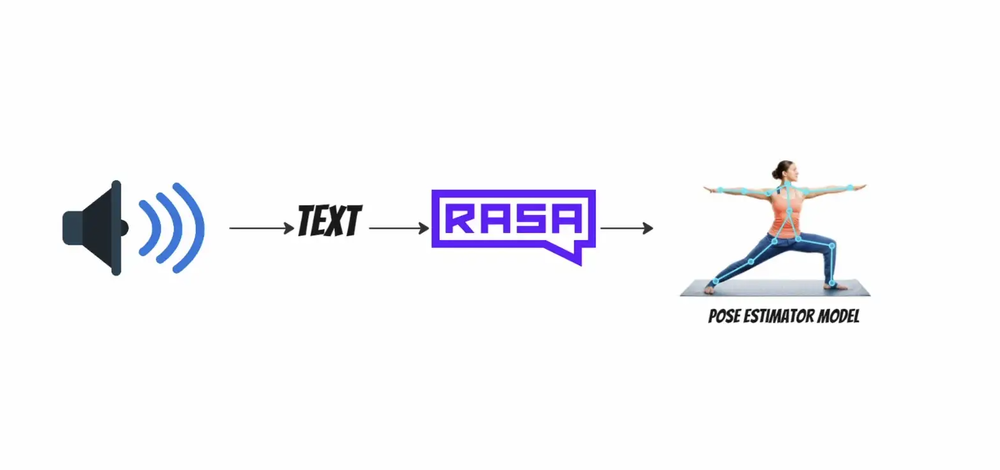

We will convert our speech into text using the SpeechRecognition library and then we will send that text to a RASA bot which will figure out the intent from the text and will carry out the corresponding actions.

We need to install a few libraries before we go ahead and start writing the code.

>gTTs — To convert Text to Speech

>SpeechRecognition — To convert Speech to Text

>playsound — To play a mp3 file using python

## Bot Script

We will write a script that will listen to our voice from the microphone and then convert it into text. After converting the sound to the text we will send the text to the RASA bot by making an HTTP request to the RASA server which we will set up in a moment. Finally, we will be using gTTs and the playsound library to reply back to the user’s input using sound.

First, we will import all the required libraries

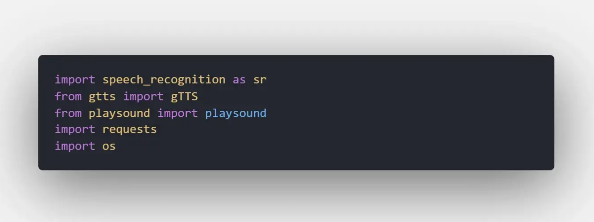

Then we will use speech_recognition to listen to sounds from the microphone and convert them into text.

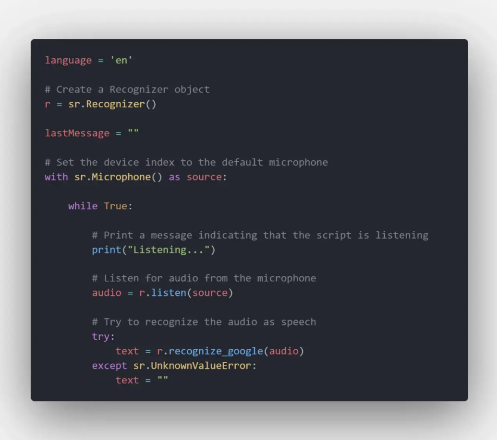

Now I want the bot to become active when i say “bestie”. It’s similar to how google assistant becomes active when we say “Alexa”.

So we check for the word “bestie” in the sentence and if it is found then the next sound input would be considered as the command for the bot.

Here’s how the entire code looks like now

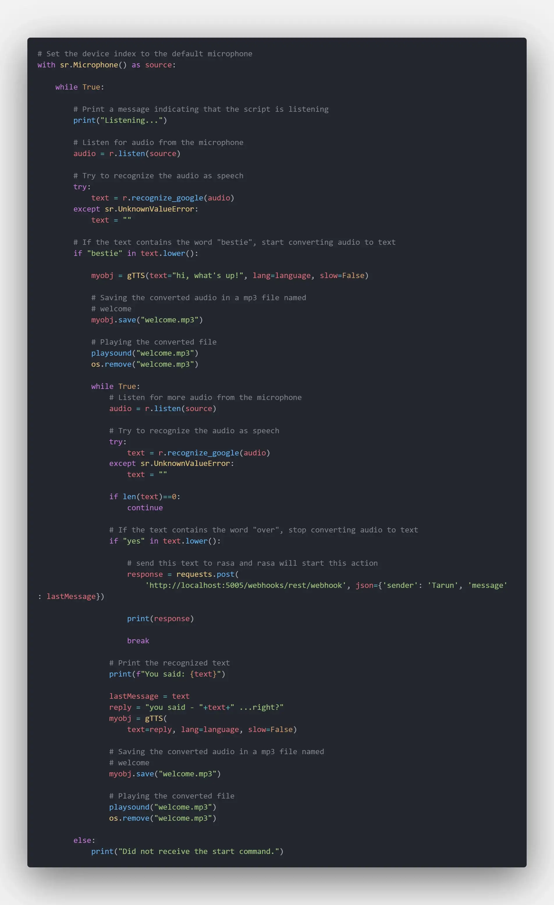

As we can see in the code, whenever the word “bestie” is found in the sentence we start another while loop and the next command will be confirmed by the bot once and then if confirmed will be sent to the rasa server using an HTTP POST request.

## RASA BOT

Rasa is a python library that we are going to use for natural language processing.

I am not going to explain the nitty-gritty details of how to use RASA in this article however I will give you an overview of all the changes that I did in the default rasa project to make it work for our use case. However, if you are unfamiliar with RASA then you can check out [this article](https://medium.com/codex/introduction-to-chatbots-with-rasa-python-463d9df058e9).

First, we will initialize a new RASA project using the command rasa init.

For our use case, we will add a new intent in the nlu.yml file. We will name our intent as start_workout.

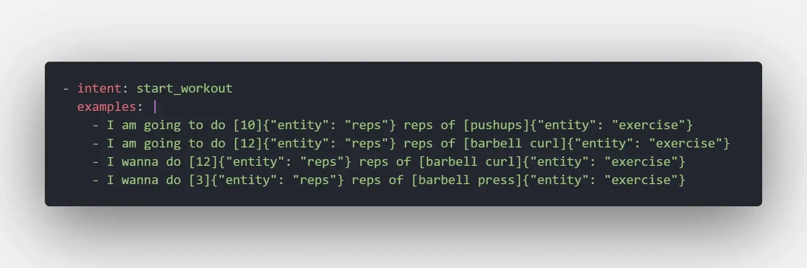

As we can see in the above picture we have two entities namely reps and exercise that we want to extract from the user’s sentences.

So if the user will say I want to do 10 reps of pushups then our rasa bot will extract 10 (reps) and pushups (exercise) from the sentence and will start an action.

In the action.py file, we will write a new action that will run another python script that will record live video from our camera and will help us do the workout.

So the action.py file looks something like this.

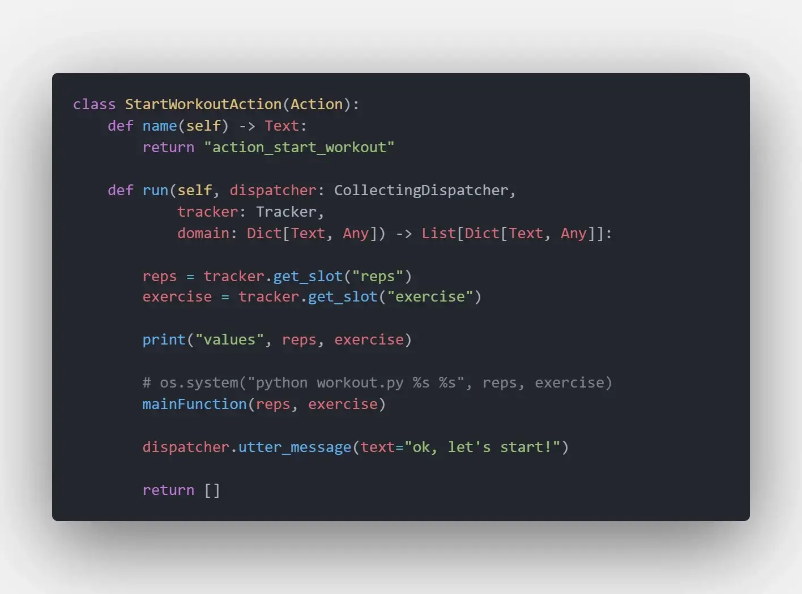

We have imported mainFunction from another python file workout.py which contains a script to record posture and count reps during our workout.

## Main Workout Script

Now the last step for us is to write a script that will record a live camera feed and do posture detection to count the reps of the particular exercise.

We are going to use mediapipe library to help us detect posture from live video frames. To install mediapipe we will run the following command

>pip install mediapipe

First we will import all the necessary libraries in our script.

To get the pose object from an image we can make use of the following code.

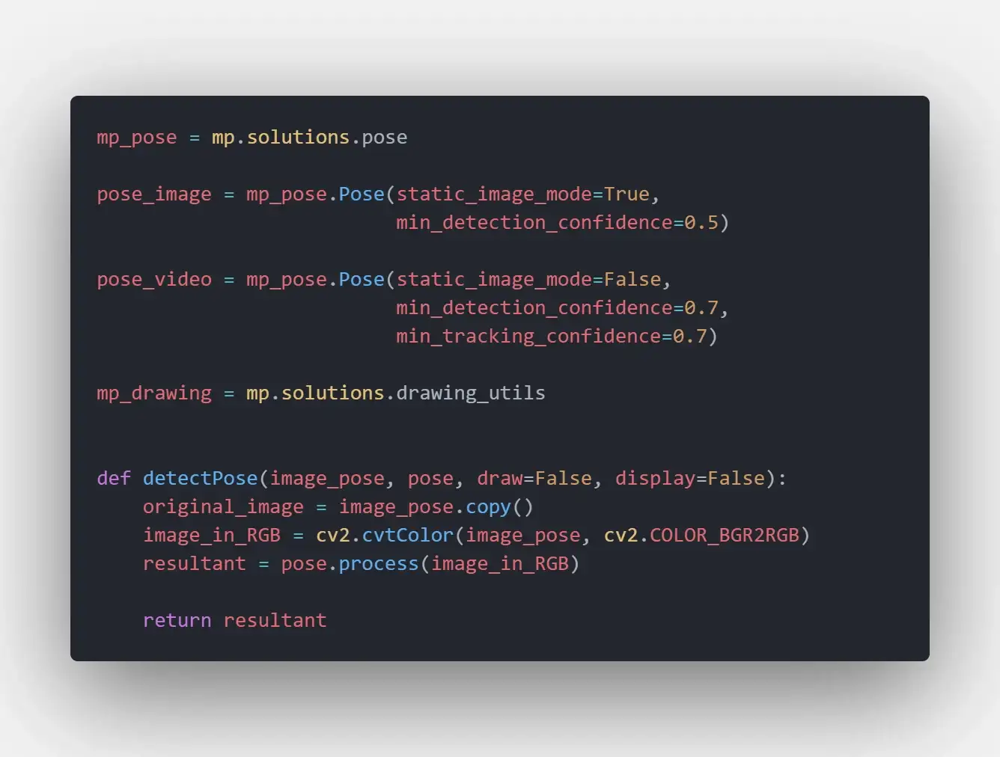

Our idea here is to compare the user’s pose against some other pose while the user is doing the workout. This will help us count the number of reps if the user is doing the workout correctly.

So we will write a compare pose function that can compare two poses using euclidean distance.

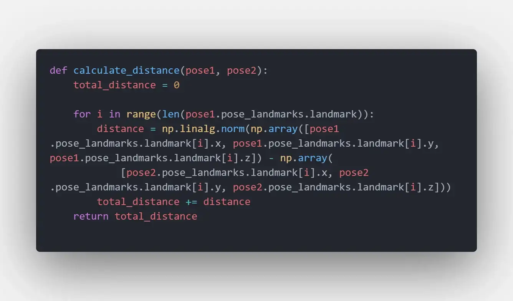

The function calculate_distance calculates the distance between two poses and if the distance between two poses comes out to be less than the threshold we will consider them as the same pose. And in that case, we will increase the number of reps by one.

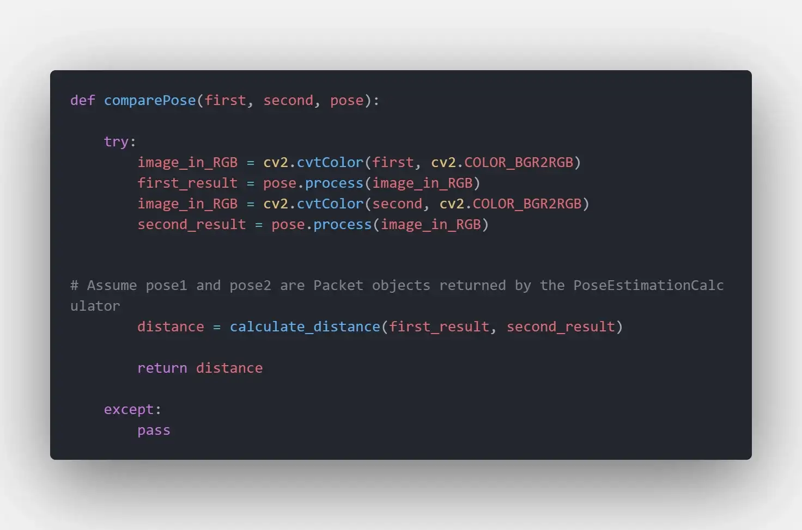

Below is the code for the main function.

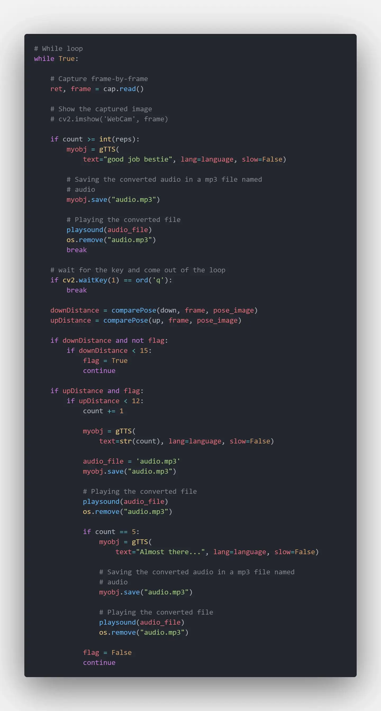

In the main function, we are comparing the user’s pose with two images.

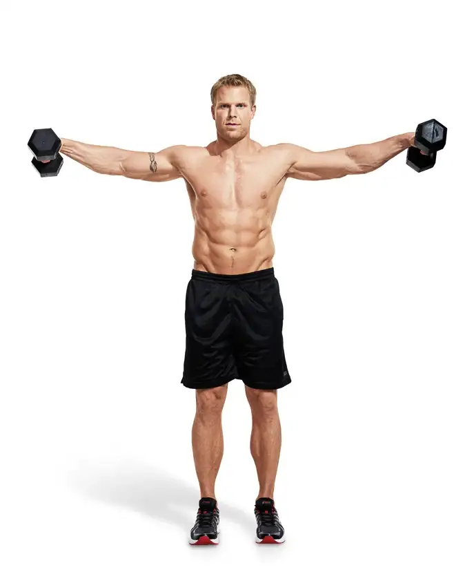

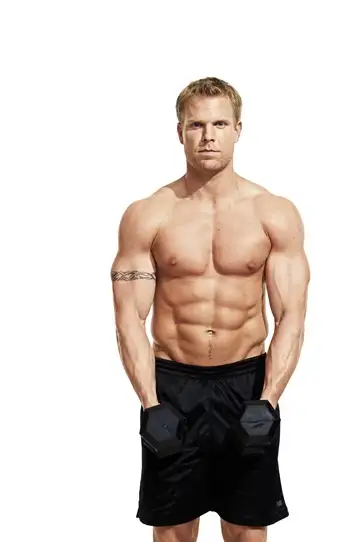

We are comparing the user’s pose with these images and calculating the distance between the poses.

Based on the distance we can predict if the user is in a first pose or second pose and subsequently we can keep a counter for reps for this particular exercise.

Other than that we have used gTTs and playsound to tell the number of reps when the user is doing the workout.

This same script can be modified to support multiple workouts pretty easily but for our use case, we have just considered one type of exercise.

## Ending Notes

So this was a step-by-step guide for you if you want to build your own gym buddy using python.

This is my first article and I have planned to write articles on all the projects that I will be doing in the future. I also upload youtube videos for the same projects so you guys can check that out if you are interested. Here’s the youtube channel [link](https://www.youtube.com/channel/UCrGNqQYtfvlD7ybzfr7gAuA).

Thank you for reading!

Please leave a comment if you have any suggestions for me.