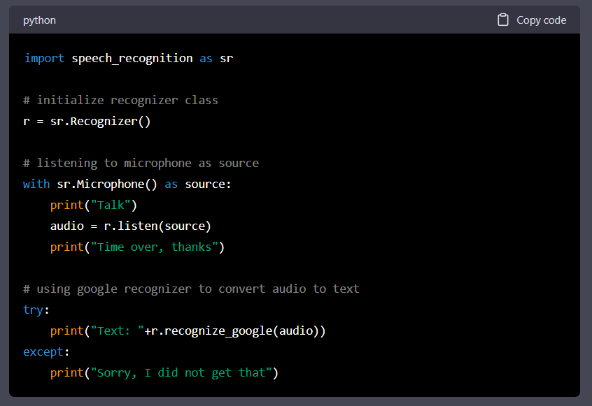

According to Google Trends, the interest in ChatGPT is at its all time peak right now. And one of the most confusing question that is currently floating around in tech industry is if ChatGPT will take away all the programming jobs.

The simple answer to this question is **NO** (subject to terms and conditions).

In this article we will discuss on this topic in greater details so let's start...

### What is chatGPT?

>ChatGPT is an AI language model developed by OpenAI. It uses deep learning algorithms and a massive amount of text data to generate human-like responses to natural language queries and provide information on a wide range of topics. The goal of ChatGPT is to allow for more natural and intuitive communication between humans and AI.

The above definition of chatGPT is written by chatGPT itself. Interesting, right?

ChatGPT can complete senteces, answer queries and most importantly **generate snippets of code from text prompts**.

So I asked chatGPT to generate python code which takes sound input and converts it to text and logs it to the console. Here's result - 

The most impressive part of the code for me was the comments. Not only the code works absolutely the way it is expected to but also it is formatted with nice comments and print statements.

> ChatGPT cannot generate code for an entire website on its own right now but with a little bit of human intervention it is possible to code anything with the help of chatGPT.

So naturally its possible to think of chatGPT as a replacement of human programmers (atleast entry level jobs are in danger), right?

**YES and NO** 

### Understanding chatGPT and Programming Jobs

Sure ChatGPT can write snippets of code and can eventually end up creating an entire software but is that the only job of a programmer?

A programmer's job is not limited to writing code for some software but instead it involved a lot of creativity to come up with the tech solutions and ideate new features for some software. On the other hand, chatGPT is not **creative** it cannot think of new ideas or solutions. All it is doing right now is completing a bunch of sentences that make sense.

> If all you know is how to prototype something from given instructions, we don't need chatGPT to replace you, you can be replaced by pretty much anyone who knows how to use chatGPT. 

**So then what should you do to make sure you are still relevant?**

Well you need to upskill yourself. You need to learn machine learning, artificial intelligence and understand how these ai tools are working, so that you can leverage the power of these ai tools in your favor and become a better programmer. 

Tools like chatGPT and github copilot are not here to replace you but instead they are here to make your job easier. 
Even before chatGPT, google existed and we as programmers relied heavly on google while coding something. 

This is certainly going to change now. People who will know about ai and its abilities will leverage the power of these ai tools and will be able to work 10-20 times faster than people who will still google "how to center a div". 

Therefore, the smartest thing to do right now is to start using these ai technologies in your favor. 

> Remember as a human computers and softwares will never be able to replace you if you know how to use them. 

## Ending Notes

If you prefer video/audio versions of articles then you can checkout my youtube channel and find a video version of this article on my youtube channel from the given [link](https://www.youtube.com/watch?v=e2m0Z56DLbU).

Thank you for reading!

Please leave a comment if you have any suggestions for me.

